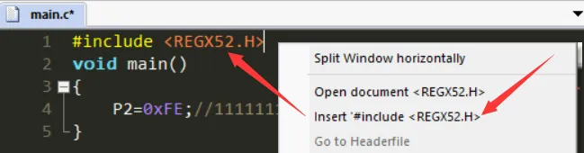

# 江协科技C51学习笔记
## 说明：
基于江协科技的教程的C51单片机学习笔记，
在B站up主**菜工啊潜**的C51笔记基础上修改而来

| 文档名称 | 版本 | 时间 | 备注 |
| :------: | :---: | :---: | :---: |
|江协科技C51学习笔记|V1.0|2024.9.25|初次建立|

## 一、环境搭建
1.  安装keilC51、购买51开发板
    安装过程：参考江协视频 [点击该链接跳转](https://www.bilibili.com/video/BV1Mb411e7re?p=2&vd_source=241c5c0df79d442e9db88752a5ca4d76)
1.  新建工程：设置存放路径、项目名
   
## 二、点灯仪式（迈入编程的第一步）
### （一）LED介绍：
中文名：发光二极管
外文名： Light Emitting Diode
简称： LED
正负极判断：	
1.  长脚正、短脚负
2.  小红旗正，大红旗负	
### （二）LED原理图：  
根据原理图：
VCC端有八个电阻，起到两个作用：
1.  VCC的电压超过了LED的正常工作电压，使用电阻限流，防止LED烧毁。
2.  由于制造工艺，LED的导通电压不一定一致，避免因钳位导致的LED无法同时亮起。  
   
原理图：  
   
实物图：  
   

如图，LED的引脚被接到了MCU的P2组上。
   

### （三）如何控制LED点亮
该开发板采用**TTL电平**：+5V代表1，0V代表0。
控制IO口的输出本质上是对**输出寄存器**进行操作，对输出寄存器写入1或者0来控制引脚的输出电平为+5V或者0V。  
   
由于C语言无法通过十进制数方便直观的赋值给每一位寄存器，而最终输出给MCU的值必须转化为二进制，在此处便涉及到进制转换。
   
在程序编写中，通常采用16进制的写法，故可以通过给P2赋值0xFE将一个LED点亮。

### （四）代码编写
1.  按先前步骤新建工程：略
2.  添加头文件： 
   
3. 示例：
   1. **点亮LED:**：
    头文件里包含了P2寄存器的地址，所以P2可以直接使用。
    烧录之后运行软件会重复执行main函数，一直调用一些可能只需要执行一次的代码，这是我们所不希望看到的，所以我们需要让程序停在其中。使用while的死循环即可。
        ```
        #include <REGX52.H>

        void main()
        {
            while(1){
                P2=0xFE;
            }
        }
        ```  
        我们也可以直接操作P2寄存器的对应位来完成：  
        ```
        #include <REGX52.H>

        void main()
        {
            while(1){
                P2_0=0;
            }
        }
        ```
    2.  **LED闪烁:**
    如果直接寄存器控制反复亮灭操作，会因为运行速度太快，区分不出LED的状态，所以需要在亮灭之间加个延迟，然后一直循环即可。
    >【循环函数】：如何创建想要的循环？
    >先了解单片机的晶振（普中C51板是：11.0592Mhz），因此在stc-isp当中点击软件延时计算器选项，注意看晶振频率的选择，确定延时时长，选择Y1指令集，最后复制代码：
    >   
    >但是延时函数当中有些用到的标识符、函数没有定义；因需要添加头文件<INTRINS.H>
    >【注】：软件生成的延迟函数可能不能用，所以我们可以尝试去网上找一个可以用的。
    3.  **LED流水灯：**
    思路就是一次只亮一个，按顺序闪烁，每个灯只闪烁一次，同时每次操作后延时一定时间。
    但是如果想更改延时怎么办呢？需要去重新生成吗？可以自己写个带参数的延时函数——通过观察按如下数据类型，进行函数类型设置。
    >【C51数据类型】：
    >  

    【带参延时函数】：
    生成1ms的延迟函数，通过定义次数的参数，让这个函数执行参数值的次数，达到指定延迟。
    ```
    void Delay_ms(unsigned int xms)
    {
        unsigned char i,j;
        while(xms)
        {
            _nop_();
            i = 2;
            j = 199;
            do{
                while (--j);
            } while (--i);
            xms--;
        }
    }

4.  首次使用需要更改配置使其生成 .hex 文件：然后编译:
     
### （五）烧录文件与效果
1.  打开烧录软件：选择芯片型号，连接单片机后选择端口:
     
2.  选择刚刚生成的HEX文件：
   一般在对应项目文件夹的Objects文件夹里，后缀为.hex。  
     
3.  点击下载/烧录，启动或者重启单片机，观察结果：
     
>【注意】：
>1. 在检测状态时，需要给单片机断电后再上电重新启动，程序才能烧录进去。
>2.  若是一直显示检测中的，把单片机型号改为**stc89c52rc**。


    