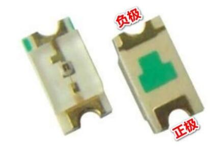

# 江协科技C51学习笔记
## 说明：
基于江协科技的教程的C51单片机学习笔记，
在B站up主**菜工啊潜**的C51笔记基础上修改而来。
原笔记路径：[点击该链接跳转](https://www.yuque.com/dive/aqianmcu/c51note?singleDoc#)
文件密码：wckd

文档进行小修改则仅更改小数点后数字，如**V1.2->V1.3**；
进行大模块的补充则更改小数点前数字，如**V1.7->V2.0**。

| 文档名称 | 版本 | 时间 | 备注 |
| :------: | :---: | :---: | :---: |
|江协科技C51学习笔记|V1.0|2024.9.25|初次建立|
|江协科技C51学习笔记|V1.1|2024.9.26|更新了独立按键部分|

## 一、环境搭建
1.  安装keilC51、购买51开发板
2.  新建工程：设置存放路径、项目名  
   
    参考江协视频 [点击该链接跳转](https://www.bilibili.com/video/BV1Mb411e7re?p=2&vd_source=241c5c0df79d442e9db88752a5ca4d76)
3.  部分常见问题：  
    -   中文出现乱码：
        修改文件编码格式为**Encode in UTF-8 without signature**即可。  
           
    -   程序报错在文件第一行但是在本文件中找不到错误：
        导致的程序出错误是在某一行的开头/某个文件的开头，一般要去找上一个行或者上一个文件。
    -   总是出现某些自己编写的库函数未使用的warnning：
        编译过程中有比较多的警告（warnning），可以在**Target小锤子**处的**BL51 Misc**中写入报错的号码，即可忽略该警告。
           
4. 进行编程的一些注意事项：
    -   模块化编程：
        模块化编程思想在单片机的学习中是非常重要的，在这里我们将其与传统编程方式做一个比较。
        |传统方式编程|模块化编程|
        |---|---|
        |所有的函数均放在main.c里，若使用的模块比较多,则一个文件内会有很多的代码，不利于代码的组织和管理,而且很影响编程者的思路。|把各个模块的代码放在不同的.c文件里，在.h文件里提供外部可调用函数的声明，其它.c文件想使用其中的代码时，只需要#include "XXX.h"文件即可。使用模块化编程可极大的提高代码的可阅读性、可维护性、可移植性等|

        -   .c文件：函数、变量的定义
        +   .h文件：可被外部调用的函数、变量的声明
        -   任何自定义的变量、函数在调用前必须有定义或声明(同一个.c)使用到的自定义函数的.c文件必须添加到工程参与编译
        +   使用到的.h文件必须要放在编译器可寻找到的地方(工程文件夹根目录、安装目录、自定义)
        +   建议所定义的.h文件直接放到根目录下（与main.c同目录），若是放在某一个文件夹里边，则需要配置keil，在编译Target(小锤子)中——选择C51栏——在includ Paths中添加其路径。  
        下图以Delay函数的模块化为示例：  
           
   
## 二、点灯仪式（迈入编程的第一步）
### （一）LED介绍：
中文名：发光二极管
外文名： Light Emitting Diode
简称： LED
正负极判断：	
1.  直插型LED：
    1.  长脚正、短脚负  
           
    2.  小红旗正，大红旗负    	
           
2. 贴片型LED：
    1. T字形：  
        0603封装的贴片发光二极管在底部都会有“T”字形符号，“T”一横的一边是正极，另一边则是负极。  
           
    2. 三角形：  
        有些贴片型LED会标有类似于三角形符号丝印，三角形底边靠近的是正极，顶角靠近的是负极。  
           
### （二）LED原理图：  
根据原理图：
VCC端有八个电阻，起到两个作用：
1.  VCC的电压超过了LED的正常工作电压，使用电阻限流，防止LED烧毁。
2.  由于制造工艺，LED的导通电压不一定一致，避免因钳位导致的LED无法同时亮起。  
   
原理图：  
   
实物图：  
   

如图，LED的引脚被接到了MCU的P2组上。  
   

### （三）如何控制LED点亮
该开发板采用**TTL电平**：+5V代表1，0V代表0。
控制IO口的输出本质上是对**输出寄存器**进行操作，对输出寄存器写入1或者0来控制引脚的输出电平为+5V或者0V。  
   
由于C语言无法通过十进制数方便直观的赋值给每一位寄存器，而最终输出给MCU的值必须转化为二进制，在此处便涉及到进制转换。  
   
在程序编写中，通常采用16进制的写法，故可以通过给P2赋值0xFE将一个LED点亮。

### （四）代码编写
1.  按先前步骤新建工程：略
2.  添加头文件：   
   
3. 示例：
   1. **点亮LED:**：
    头文件里包含了P2寄存器的地址，所以P2可以直接使用。  
    根据原理图所示，LED的阴极被接到了单片机上，故将对应IO口置为低电平即可点亮LED。
    烧录之后运行软件会重复执行main函数，一直调用一些可能只需要执行一次的代码，这是我们所不希望看到的，所以我们需要让程序停在其中。使用while的死循环即可。
        ```
        #include <REGX52.H>

        void main()
        {
            while(1){
                P2=0xFE;
            }
        }
        ```  
        我们也可以直接操作P2寄存器的对应位来完成：  
        ```
        #include <REGX52.H>

        void main()
        {
            while(1){
                P2_0=0;
            }
        }
        ```
    2.  **LED闪烁:**
    如果直接寄存器控制反复亮灭操作，会因为运行速度太快，区分不出LED的状态，所以需要在亮灭之间加个延迟，然后一直循环即可。
        >【循环函数】：如何创建想要的循环？
        >先了解单片机的晶振（普中C51板是：11.0592Mhz），因此在stc-isp当中点击软件延时计算器选项，注意看晶振频率的选择，确定延时时长，选择Y1指令集，最后复制代码：
        >   
        >但是延时函数当中有些用到的标识符、函数没有定义；因需要添加头文件<INTRINS.H>
        >【注】：软件生成的延迟函数可能不能用，所以我们可以尝试去网上找一个可以用的。
    3.  **LED流水灯：**
    思路就是一次只亮一个，按顺序闪烁，每个灯只闪烁一次，同时每次操作后延时一定时间。
    但是如果想更改延时怎么办呢？需要去重新生成吗？可以自己写个带参数的延时函数——通过观察按如下数据类型，进行函数类型设置。
        >【C51数据类型】：  
        >  

        >【带参延时函数】：
        >生成1ms的延时函数，通过定义次数的参数，让这个函数执行参数值的次数，达到指定延迟。
        ```
        void Delay_ms(unsigned int xms)
        {
            unsigned char i,j;
            while(xms)
            {
                _nop_();
                i = 2;
                j = 199;
                do{
                    while (--j);
                } while (--i);
                xms--;
            }
        }
        ```

4.  首次使用需要更改配置使其生成 .hex 文件：然后编译:  
     
### （五）烧录文件与效果
1.  打开烧录软件：选择芯片型号，连接单片机后选择端口:    
     
2.  选择刚刚生成的HEX文件：
   一般在对应项目文件夹的Objects文件夹里，后缀为.hex。  
      
3.  点击下载/烧录，启动或者重启单片机，观察结果：  
     
>【注意】：
>1. 在检测状态时，需要给单片机断电后再上电重新启动，程序才能烧录进去。
>2. 若是按下烧录按键后一直显示检测中的，把单片机型号改为**stc89c52rc**。

## 三、独立按键
### （一）独立按键介绍：
相当于是一种开关，按下时开关接通，松开时开关断开，实现原理是通过轻触按键内部的金属弹片受力弹动来实现接通和断开。  
     
### （二）独立按键原理图
根据原理图，独立按键一端均被接于GND，故按下时相当于IO口与GND（0V）直接相连。
原理图：  
    
   
实物图：  
    
>【注意】：四个独立按键并不是按照P3_0、P3_1、P3_2、P3_3的顺序接在单片机上的，正确的顺序是P3_1、P3_0、P3_2、P3_3。
### （三）代码实现
1.  **按键控制LED亮灭：**
    1.  通过读取对应位的寄存器，让这个位的0或1控制相关灯的亮灭，其中我们通过按键来控制对应引脚的输入电平。
    2.  通过原理图找到按键对应的引脚Key1（P3_1）、Key2（P3_0）、Key3（P3_2）、Key4（P3_3）。
    ```
    #include <REGX52.H>
    void main()
    {
        while(1){
            if(P3_1==1){
                P2_0=1;
            }else{
                P2_0=0;
            }
        }
    }
    ```    
    >C51数据运算：  
    >    
    【注】：整型与整型相除若除出小数则只取整数部分。  
2.  **摁键控制LED状态：**  
    摁键摁下的时候产生抖动会不稳定，要消除抖动，利用延时函数，等待稳定之后，再检测寄存器的电平状态。这个稳定指的是松手之后的稳定，也就是说需要检测松手。一直没有松手就一直循环等你松手（电平变化）。然后再消松开时的抖动。就可以进行相关的操作（摁一次取反一次实现控制开关）了。
    由于需要消抖，因此我们需要一个**延时函数**:
    ```
    void Delay_ms(unsigned int xms)
    {
        unsigned char i,j;
        while(xms)
        {
            _nop_();
            i = 2;
            j = 199;
            do{
                while (--j);
            } while (--i);
            xms--;
        }
    }
    ```
    >【按键的抖动】
    对于机械开关，当机械触点断开、闭合时，由于机械触点的弹性作用，一个开关在闭合时不会马上稳定地接通,在断开时也不会一下子断开，所以在开关闭合及断开的瞬间会伴随一连串的抖动，实际IO口处电平如图：  
    >    
    ```
    #include <REGX52.H>
    #include "Delay.h"
    void Delay_ms(unsigned int xms)；
    void main()
    {
        while(1)
        {
            if(P3_1==0)
            {
                Delay_ms(20);//按下消抖延时
                while(P3_1==0);//检测松手
                //摁一次取反一次即为开关
                P2_0=~P2_0;
                Delay_ms(20);//松开消抖延时
            }
        }
    }
    ```
3.  **按键控制LED显示二进制：**
    >【注意】：默认LED的P2寄存器全是高电平1111 1111；若此时直接操作寄存器进行进位，则会溢出。

    我们可以定义一个unsigned某类型变量，因为unsigned的8位的，然后修改其数值，再送给要操作的寄存器。(全局变量默认是0，建议少定义。局部变量定义需要赋初始值)
    ```
    //略
    unsigned char LedNum=0;
    //略
    if(P3_1==0)
    {
        Delay_ms(20);//摁下消抖延时
        while(P3_1==0);//检测松手
        Delay_ms(20);//松开消抖延时	
        //进位显示
        LedNum++;
        //直接赋值对于LedNum来说只是读操作，并不会改变本身的值.
        //而对于P2来说是写操作，会改变本身的值。
        P2=~LedNum;//因为LED的阴极接在MCU上，需取反
    }
    ```

4.  **按键控制LED移位：**
    P2寄存器默认全1电平（注意LED是阴极接在P2寄存器上，给0亮，给1灭），赋值为0x01后，使用移位运算符进行移位操作，情况如图，当移动到最后一位的时候，需要判断是否越界，再次赋值为0x01。一直循环该操作即可。
    >**移位运算：**
    >   
    ```
    void main()
    {
        unsigned char LedNum=0;
        //因为摁下就移位，所以让第一个先亮，不然看不到
        P2=~0x01;
        while(1)
        {
            //K1操作
            if(P3_1==0)
            {
                Delay_ms(20);//摁下消抖延时
                while(P3_1==0);//检测松手
                Delay_ms(20);//松开消抖延时
                
                //移位显示（左移1位）
                LedNum++;
                if(LedNum>=8)
                    LedNum=0;
                P2=~(0x01<<LedNum);
                
                Delay_ms(20);
            }
            //K2操作
            if(P3_0==0)
            {
                Delay_ms(20);//摁下消抖延时
                while(P3_0==0);//检测松手
                Delay_ms(20);//松开消抖延时
                
                //移位显示（右移1位）
            //因为定义的LedNum是无符号的，若是0的时候减，就会溢出，这时需要变为最高
                if(LedNum==0)
                    LedNum=7;
                else
                    LedNum--;
                //因为重新赋值为0x01了，所以不用改移位方向
                P2=~(0x01<<LedNum);
                
                Delay_ms(20);
            }
        }
    }
    ```