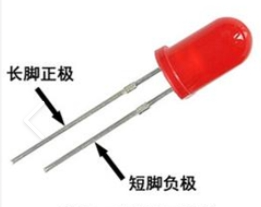
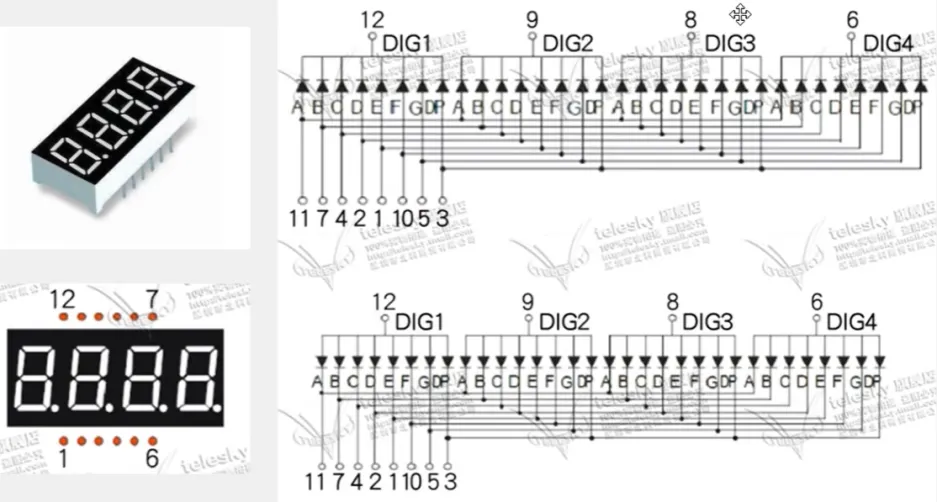
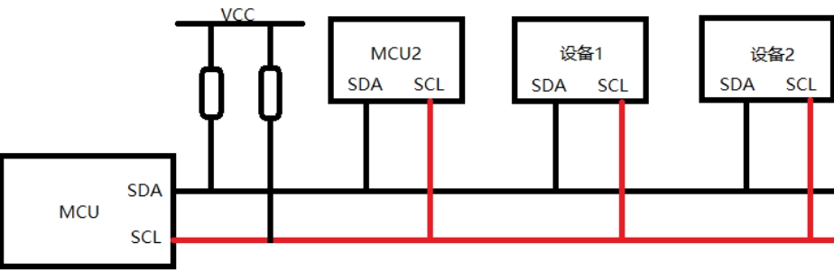

# 江协科技C51学习笔记
## 说明：
基于江协科技的教程的C51单片机学习笔记，
在B站up主**菜工啊潜**的C51笔记基础上修改而来。
原笔记路径：[点击该链接跳转](https://www.yuque.com/dive/aqianmcu/c51note?singleDoc#)
文件密码：wckd

文档进行小修改则仅更改小数点后数字，如**V1.2->V1.3**；
进行大模块的补充则更改小数点前数字，如**V1.7->V2.0**。

| 文档名称 | 版本 | 时间 | 备注 |
| :------: | :---: | :---: | :---: |
|江协科技C51学习笔记|V1.0|2024.9.25|初次建立|
|江协科技C51学习笔记|V1.1|2024.9.26|更新了独立按键和数码管部分|
|江协科技C51学习笔记|V1.2|2024.9.27|更新了LCD1602和矩阵键盘部分|
|江协科技C51学习笔记|V1.3|2024.9.29|更新了串口部分|

## 一、环境搭建
1.  安装keilC51、购买51开发板
2.  新建工程：设置存放路径、项目名  
   
    参考江协视频 [点击该链接跳转](https://www.bilibili.com/video/BV1Mb411e7re?p=2&vd_source=241c5c0df79d442e9db88752a5ca4d76)
3.  部分常见问题：  
    -   中文出现乱码：
        修改文件编码格式为**Encode in UTF-8 without signature**即可。  
           
    -   程序报错在文件第一行但是在本文件中找不到错误：
        导致的程序出错误是在某一行的开头/某个文件的开头，一般要去找上一个行或者上一个文件。
    -   总是出现某些自己编写的库函数未使用的warnning：
        编译过程中有比较多的警告（warnning），可以在**Target小锤子**处的**BL51 Misc**中写入报错的号码，即可忽略该警告。
           
4. 进行编程的一些注意事项：
    -   模块化编程：
        模块化编程思想在单片机的学习中是非常重要的，在这里我们将其与传统编程方式做一个比较。
        |传统方式编程|模块化编程|
        |---|---|
        |所有的函数均放在main.c里，若使用的模块比较多,则一个文件内会有很多的代码，不利于代码的组织和管理,而且很影响编程者的思路。|把各个模块的代码放在不同的.c文件里，在.h文件里提供外部可调用函数的声明，其它.c文件想使用其中的代码时，只需要#include "XXX.h"文件即可。使用模块化编程可极大的提高代码的可阅读性、可维护性、可移植性等|

        -   .c文件：函数、变量的定义
        +   .h文件：可被外部调用的函数、变量的声明
        -   任何自定义的变量、函数在调用前必须有定义或声明(同一个.c)使用到的自定义函数的.c文件必须添加到工程参与编译
        +   使用到的.h文件必须要放在编译器可寻找到的地方(工程文件夹根目录、安装目录、自定义)
        +   建议所定义的.h文件直接放到根目录下（与main.c同目录），若是放在某一个文件夹里边，则需要配置keil，在编译Target(小锤子)中——选择C51栏——在includ Paths中添加其路径。  
        下图以Delay函数的模块化为示例：  
           
   
## 二、点灯仪式（迈入编程的第一步）
### （一）LED介绍：
中文名：发光二极管  
外文名： Light Emitting Diode  
简称： LED  
正负极判断：	
1.  直插型LED：
    1.  长脚正、短脚负  
           
    2.  小红旗正，大红旗负  
           
2. 贴片型LED：
    1. T字形：  
        0603封装的贴片发光二极管在底部都会有“T”字形符号，“T”一横的一边是正极，另一边则是负极。  
           
    2. 三角形：  
        有些贴片型LED会标有类似于三角形符号丝印，三角形底边靠近的是正极，顶角靠近的是负极。  
           
### （二）LED原理图：  
根据原理图：
VCC端有八个电阻，起到两个作用：
1.  VCC的电压超过了LED的正常工作电压，使用电阻限流，防止LED烧毁。
2.  由于制造工艺，LED的导通电压不一定一致，避免因钳位导致的LED无法同时亮起。  
   
原理图：  
   
实物图：  
   

如图，LED的引脚被接到了MCU的P2组上。  
   

### （三）如何控制LED点亮
该开发板采用**TTL电平**：+5V代表1，0V代表0。
控制IO口的输出本质上是对**输出寄存器**进行操作，对输出寄存器写入1或者0来控制引脚的输出电平为+5V或者0V。  
   
由于C语言无法通过十进制数方便直观的赋值给每一位寄存器，而最终输出给MCU的值必须转化为二进制，在此处便涉及到进制转换。  
   
在程序编写中，通常采用16进制的写法，故可以通过给P2赋值0xFE将一个LED点亮。

### （四）代码编写
1.  按先前步骤新建工程：略
2.  添加头文件：   
   
3. 示例：
   1. **点亮LED:**：
    头文件里包含了P2寄存器的地址，所以P2可以直接使用。  
    根据原理图所示，LED的阴极被接到了单片机上，故将对应IO口置为低电平即可点亮LED。
    烧录之后运行软件会重复执行main函数，一直调用一些可能只需要执行一次的代码，这是我们所不希望看到的，所以我们需要让程序停在其中。使用while的死循环即可。
        ```
        #include <REGX52.H>

        void main()
        {
            while(1){
                P2=0xFE;
            }
        }
        ```  
        我们也可以直接操作P2寄存器的对应位来完成：  
        ```
        #include <REGX52.H>

        void main()
        {
            while(1){
                P2_0=0;
            }
        }
        ```
    2.  **LED闪烁:**
    如果直接寄存器控制反复亮灭操作，会因为运行速度太快，区分不出LED的状态，所以需要在亮灭之间加个延迟，然后一直循环即可。
        >【循环函数】：如何创建想要的循环？
        >先了解单片机的晶振（普中C51板是：11.0592Mhz），因此在stc-isp当中点击软件延时计算器选项，注意看晶振频率的选择，确定延时时长，选择Y1指令集，最后复制代码：
        >   
        >但是延时函数当中有些用到的标识符、函数没有定义；因需要添加头文件<INTRINS.H>
        >【注】：软件生成的延迟函数可能不能用，所以我们可以尝试去网上找一个可以用的。
    3.  **LED流水灯：**
    思路就是一次只亮一个，按顺序闪烁，每个灯只闪烁一次，同时每次操作后延时一定时间。
    但是如果想更改延时怎么办呢？需要去重新生成吗？可以自己写个带参数的延时函数——通过观察按如下数据类型，进行函数类型设置。
        >【C51数据类型】：  
        >  

        >【带参延时函数】：
        >生成1ms的延时函数，通过定义次数的参数，让这个函数执行参数值的次数，达到指定延迟。
        ```
        void Delay_ms(unsigned int xms)
        {
            unsigned char i,j;
            while(xms)
            {
                _nop_();
                i = 2;
                j = 199;
                do{
                    while (--j);
                } while (--i);
                xms--;
            }
        }
        ```

4.  首次使用需要更改配置使其生成 .hex 文件：然后编译:  
     
### （五）烧录文件与效果
1.  打开烧录软件：选择芯片型号，连接单片机后选择端口:    
     
2.  选择刚刚生成的HEX文件：
   一般在对应项目文件夹的Objects文件夹里，后缀为.hex。  
      
3.  点击下载/烧录，启动或者重启单片机，观察结果：  
     
>【注意】：
>1. 在检测状态时，需要给单片机断电后再上电重新启动，程序才能烧录进去。
>2. 若是按下烧录按键后一直显示检测中的，把单片机型号改为**stc89c52rc**。

## 三、独立按键
### （一）独立按键介绍：
相当于是一种开关，按下时开关接通，松开时开关断开，实现原理是通过轻触按键内部的金属弹片受力弹动来实现接通和断开。  
     
### （二）独立按键原理图
根据原理图，独立按键一端均被接于GND，故按下时相当于IO口与GND（0V）直接相连。
原理图：  
    
   
实物图：  
    
>【注意】：四个独立按键并不是按照P3_0、P3_1、P3_2、P3_3的顺序接在单片机上的，正确的顺序是P3_1、P3_0、P3_2、P3_3。
### （三）代码编写：
1.  **按键控制LED亮灭：**
    1.  通过读取对应位的寄存器，让这个位的0或1控制相关灯的亮灭，其中我们通过按键来控制对应引脚的输入电平。
    2.  通过原理图找到按键对应的引脚Key1（P3_1）、Key2（P3_0）、Key3（P3_2）、Key4（P3_3）。
    ```
    #include <REGX52.H>
    void main()
    {
        while(1){
            if(P3_1==1){
                P2_0=1;
            }else{
                P2_0=0;
            }
        }
    }
    ```    
    >C51数据运算：  
    >    
    【注】：整型与整型相除若除出小数则只取整数部分。  
2.  **摁键控制LED状态：**  
    摁键摁下的时候产生抖动会不稳定，要消除抖动，利用延时函数，等待稳定之后，再检测寄存器的电平状态。这个稳定指的是松手之后的稳定，也就是说需要检测松手。一直没有松手就一直循环等你松手（电平变化）。然后再消松开时的抖动。就可以进行相关的操作（摁一次取反一次实现控制开关）了。
    由于需要消抖，因此我们需要一个**延时函数**:
    ```
    void Delay_ms(unsigned int xms)
    {
        unsigned char i,j;
        while(xms)
        {
            _nop_();
            i = 2;
            j = 199;
            do{
                while (--j);
            } while (--i);
            xms--;
        }
    }
    ```
    >【按键的抖动】
    对于机械开关，当机械触点断开、闭合时，由于机械触点的弹性作用，一个开关在闭合时不会马上稳定地接通,在断开时也不会一下子断开，所以在开关闭合及断开的瞬间会伴随一连串的抖动，实际IO口处电平如图：    
    >     
    ```
    #include <REGX52.H>
    #include "Delay.h"
    void Delay_ms(unsigned int xms)；
    void main()
    {
        while(1)
        {
            if(P3_1==0)
            {
                Delay_ms(20);//按下消抖延时
                while(P3_1==0);//检测松手
                //摁一次取反一次即为开关
                P2_0=~P2_0;
                Delay_ms(20);//松开消抖延时
            }
        }
    }
    ```
3.  **按键控制LED显示二进制：**
    >【注意】：默认LED的P2寄存器全是高电平1111 1111；若此时直接操作寄存器进行进位，则会溢出。

    我们可以定义一个unsigned某类型变量，因为unsigned的8位的，然后修改其数值，再送给要操作的寄存器。(全局变量默认是0，建议少定义。局部变量定义需要赋初始值)
    ```
    //略
    unsigned char LedNum=0;
    //略
    if(P3_1==0)
    {
        Delay_ms(20);//摁下消抖延时
        while(P3_1==0);//检测松手
        Delay_ms(20);//松开消抖延时	
        //进位显示
        LedNum++;
        //直接赋值对于LedNum来说只是读操作，并不会改变本身的值.
        //而对于P2来说是写操作，会改变本身的值。
        P2=~LedNum;//因为LED的阴极接在MCU上，需取反
    }
    ```

4.  **按键控制LED移位：**
    P2寄存器默认全1电平（注意LED是阴极接在P2寄存器上，给0亮，给1灭），赋值为0x01后，使用移位运算符进行移位操作，情况如图，当移动到最后一位的时候，需要判断是否越界，再次赋值为0x01。一直循环该操作即可。
    >**移位运算：**   
    >    
    ```
    void main()
    {
        unsigned char LedNum=0;
        //因为摁下就移位，所以让第一个先亮，不然看不到
        P2=~0x01;
        while(1)
        {
            //K1操作
            if(P3_1==0)
            {
                Delay_ms(20);//摁下消抖延时
                while(P3_1==0);//检测松手
                Delay_ms(20);//松开消抖延时
                
                //移位显示（左移1位）
                LedNum++;
                if(LedNum>=8)
                    LedNum=0;
                P2=~(0x01<<LedNum);
                
                Delay_ms(20);
            }
            //K2操作
            if(P3_0==0)
            {
                Delay_ms(20);//摁下消抖延时
                while(P3_0==0);//检测松手
                Delay_ms(20);//松开消抖延时
                
                //移位显示（右移1位）
            //因为定义的LedNum是无符号的，若是0的时候减，就会溢出，这时需要变为最高
                if(LedNum==0)
                    LedNum=7;
                else
                    LedNum--;
                //因为重新赋值为0x01了，所以不用改移位方向
                P2=~(0x01<<LedNum);
                
                Delay_ms(20);
            }
        }
    }
    ```
## 四、数码管
### （一）数码管介绍：   
LED数码管是一种简单、廉价的显示器，由多个发光二极管封装在一起组成“8”字型的器件，引线已在内部连接完成，只需引出它们的各个笔划，公共电极。  
数码管实际上是由七个发光管组成8字形构成的，加上小数点就是8个。这些段分别由字母a,b,c,d,e,f,g,dp来表示。   
    
### （二）数码管原理图：
根据资料中的原理图：    
    
可以看到数码管其实与芯片相连的138译码器和74HC245。
为什么需要这两颗IC呢？其中COM是公共端，想要选择其中的某个数码管亮，可以拉低对应的COM端口（因为板上的数码管是共阴极的，共阳极则反之，需要拉高），假设要第三根数码管亮，并且显示数字1，其发送给COM端位选为11011111数据（选中第三个数码管），段选为10011111（使数码管显示1）,DIR接高电平。图中的电容是用来滤波的，滤除不稳定的电源信号。
>74HC245芯片引脚定义：   
>    

图中COM端的LED1到8连接着138译码器的7到15引脚，而要控制这8个引脚的输出相应数据，只需要1到3这三个引脚，C脚是二进制高位，即CBA，所表示的二进制数对应的十进制数为LED被选中序号（从0起始）。其中引脚4到6为使能（即芯片是否工作的开关）引脚，当6脚接VCC，4/5脚接地时候，改芯片处于工作状态。因此138译码器是为了控制多位数码管，方便选中位数的。  

### （三）单/多段数码管：
|单个数码管（C51开发板上共阴极）|多个数码管（多几位，动态显示）|
|:---:|:---:|  
|||  
|可以持续显示，即静态显示。|每一个时刻最多有一个数码管点亮（即使有多个同时点亮，显示的数据也只能是同样的），只能通过快速切换，利用视觉暂留，达到全显示的效果。|  

### （四）代码编写：
1.  **静态显示:**
   通过直接操作IO口进行段选和位选，使单个数码管显示对应数字。
    >**段选和位选**是在数码管中的两个概念:
    >-  段选：选择要点亮的LED段，即数码管的不同部分，例如数字0-9中的某个线段。
    >-  位选：选择要显示的位，即数码管的不同数字或字符。
    ```
    #include <REGX52.H>
    void main()
    {
        //位选信息
        P2_4=1;
        P2_3=0;
        P2_2=1;
        //段选信息
        P0=0x7D;
        while(1)
        {	}
    }
    ```
2.  **静态显示：进行封装优化**  
   通过子函数和数组进行封装，控制函数形参进行段选和位选。
    >【数组】：把相同类型的一系列数据统一编制到某一个组别中，可以通过数组名+索引号简单快捷的操作大量数据。当然注意所定义的数组的边界值，不建议发生数组越界的事情。
    >【子函数】：将完成某一种功能的程序代码单独抽取出来形成一个模块,在其它函数中可随时调用此模块，以达到代码的复用和优化程序结构的目的。

    利用如下**数码管段码表**：   
       
    ```
    #include <REGX52.H>
    //可以利用数组对显示数据进行封装
    unsigned char NixieTable[]={0x3F,0x06,0x5B,0x4F,0x66,0x7D,0x07,0x7F,0x6F,0x77}
    //参数：位选，段选要显示的数字
    void Nixie(unsigned char Location,Number)
    {
        switch(Location)
        {
            case 1:P2_4=1;P2_3=1;P2_2=1;break;
            case 2:P2_4=1;P2_3=1;P2_2=0;break;
            case 3:P2_4=1;P2_3=0;P2_2=1;break;
            case 4:P2_4=1;P2_3=0;P2_2=0;break;
            case 5:P2_4=0;P2_3=1;P2_2=1;break;
            case 6:P2_4=0;P2_3=1;P2_2=0;break;
            case 7:P2_4=0;P2_3=0;P2_2=1;break;
            case 8:P2_4=0;P2_3=0;P2_2=0;break;
        }
        P0=NixieTable[Number];
    }
    void main()
    {
        //位选信息
        //P2_4=1;
        //P2_3=0;
        //P2_2=1;
        //段选信息
        //P0=0x7D;
        Nixie(7,2);
        while(1)
        {}
    }
    ```
3.  **动态显示:**
   当我们把封装好的数码管显示函数放入while循环当中，并间隔添加延时函数可以看到按顺序的闪烁。     
       
    那么只要将其中的延时去掉就可以让其持续显示至视觉暂留的状态了吗？不会，如图：  
        
     根据数码管显示的原理，显示的顺序是 位选 -->段选-->位选-->段选-->位选 这样循环，而问题就出现在段选-->位选这里，虽然单片机工作频率很快但是也是需要一定的时间来工作，当完成一个操作内的位选之后，段选之前的这段单片机还在工作的时间里，我称之为“空白时间”。在“空白时间”内，由于还未进行下一个段选，此时的段选还是上一个操作里的段选，导致LED模块显示的是上一个LED模块的样子。
    那么应该如何解决这种现象呢，也就是所说的**消影**。
    即在封装函数当中进行延时，使其本次内容稳定显示后，清零数码管，再执行下一次显示的内容。  
    ```
    #include <REGX52.H>
    //延时函数
    void Delay1ms(unsigned int xms)//1ms单位的延迟函数
    {
        //略
    }
    //可以利用数组对显示数据进行封装
    unsigned char NixieTable[]={0x3F,0x06,0x5B,0x4F,0x66,0x7D,0x07,0x7F,0x6F,0x77};
    //参数：位选，段选要显示的数字
    void Nixie(unsigned char Location,Number)
    {
        switch(Location)
        {
            //case:略
        }
        P0=NixieTable[Number];
        Delay1ms(1);
        
        P0=0x00;
    }
    void main()
    {
        while(1)
        {
            Nixie(1,1);
            Nixie(2,2);
            Nixie(3,3);
        }
    }
    ```
### （五）数码管的驱动方式:
|单片机直接扫描|专用驱动芯片|
|---|---|
|硬件设备简单,但会耗费大量的单片机CPU时间|内部自带显存、扫描电路，单片机只需告诉它显示什么即可|

##  五、LCD1602调试工具：
普中的51开发板附带了一个LCD1602液晶屏，使用其作为调试窗口，可以提供类似printf函数的功能，能够实时观察单片机内部数据的变换情况，便于调试和演示。   
LCD1602能显示 2 行字符信息，每行又能显示 16 个字符。它是一种专门用来显示字母、数字、符号的点阵型液晶模块。它是由若干个 5x7 或者 5x10 的点阵字符位组成，每个点阵字符位都可以用显示一个字符， 每位之间有一个点距的间隔，每行之间也有间隔，起到了字符间距和行间距的作用。因为各个部分直接并不连续故它基本不能用来显示图片。  
由于LCD1602的驱动较为复杂，本部分并不进行详细介绍，仅要求会使用江协科技提供的显示函数。     
    
LCD1602代码[点击该链接跳转](https://pan.baidu.com/s/1vDTN2o8ffvczzNQGfyjHng) 提取码：gdzf，压缩包的解压密码：51。  
LCD1602使用排针与开发板相连接，对应在开发板左上角的第一排排母，位置如下图：   
    
注意安装的方向，安装后应如下图：    
    

## 六、矩阵键盘
### （一）矩阵键盘简介：
独立按键的连接虽然简单但也带来了一个缺点：有多少的按键就要占用多少个引脚，大部分的单片机引脚资源是比较紧张的。故为了节省引脚，在键盘中按键数量较多时，为了减少I/O口的占用，通常将按键排列成矩阵形式。
矩阵键盘的读取通常采用逐行或逐列的“扫描”,读出各个位置按键的状态。有些教程会使用数码管进行显示，但显示的数量有限，有的通过串口输出到电脑上显示，但不够独立；因此本教程搭配使用1602液晶屏进行学习，液晶屏功能函数已经封装好，导入头文件后，会调用即可。
### （二）矩阵按键原理图：
资料中的原理图：  
    
实物图：   
    
原理图的P15端口接到了步进电机的输入端口上，而另一端输出的端口连在了BZ上，也就是蜂鸣器上。而该款单片机的蜂鸣器是无源蜂鸣器。因此，只要矩阵键盘有所错误，蜂鸣器就会响，无法关闭，这种情况是引脚冲突造成的。（据说新版的51开发板已经改了）
那么逐行/列扫描是如何实现的读取对应按键的呢？
逐行，逐列扫描的本质和行列扫描比较类似，本质是给某一行/某一列，低电平，其余七个全部为高电平，这时候读取电平变换，有电平变低表示按键按下，即可读取按键数据。
比如逐行扫描：
1.  置第1行为低电平，其余N-1行和N列为高电平，
2.  读取列线数据，列线有低电平表示此行有按键按下，比如按下的是1行三列(1x3)，那么第三列的列线IO口就为低电平。
3.  置第2行为低电平，其余N-1行和N列为高电平，，读取列线数据，列线有低电平表示此行有按键按下。
4.  以此类推，进行逐行扫描。
5.  根据行线列线的电平不同可以识别是否有按键按下，哪一个按键按下，获取按键号。(N) 根据按键号跳转至对应的按键处理程序。  
   
对应原理图中的P1口，
1.  给P1.0赋值为低电平，P1.1~p1.7为高电平，如果这时候有按键按下那么四个列线，P1.4，P1.5，P1.6，P1.7就有一个列会变成低电平。因此P1的值就不等于0xfe，这是就可以判断有按键按下。
2.  延时一段时间去抖动，然后给P1.1赋值为低电平，其他为高电平，这时如果有在P1.1线上的P1.4，P1.5，P1.6，P1.7有按键按下，那么就会出现低电平，从而判断哪个按键按下。
3.  如果没有那么就给P1.2赋值为低电平，其他为高电平.，相同方法判断是否有按键按下。
4.  如此类推，一共四次检测。

>注：为什么可以这么读取IO？   
>我们使用的STC89C52RC的IO是一种准双向口结构，特点是弱上拉强下拉。简单来说就是，在输出5V的时候其实IO端口和实际上5V电源之间有个电阻，而IO端口在输出0V时和GND之间是没有这个电阻的，所以我们这样直接置5V和0V并将两个IO直接相连不会导致短路，而电阻的存在使得IO端口处读取得到的电平为低电平。
### （三）代码编写：
1.  **读取矩阵按键：**
    1.  前置工作：首先创建工程，将Delay.h、Delay.c、LCD1602.h、LCD1602.c四个文件复制到项目的main.c同目录下，用来进行显示的操作。
    2.  在Keil的工程项目中右键source group——>添加已经存在的文件——（查看所有文件）选择这四个文件加入目录即可。代码中引入头文件，#include "Delay.h"、#include "LCD1602.h"完成布置。
    3.  初始化LCD1602，在初始化函数LCD_Init();右键前往定义查看消息，此时如果不行就编译一下，或者按提示打勾某设置并重启Keil。按照定义注释进行使用LCD驱动函数。先试一下输出"HelloWorld"到LCD1602。
    4.  模块化进行开发矩阵键盘代码开发：新建.c文件，根据原理图引脚设置，进行编写。
    ```
    #include <REGX52.H>
    #include "Delay.h"
    /**
    * @brief  矩阵键盘读取按键建码
    * @param  无
    * @retval KeyNumber 按下按键的代码值
    * 如果按键按住不放程序会停留在此函数，松后的一瞬间，返回键码值。没有按键按下时，返回0；
    */
    unsigned char MatrixKey()
    {
        unsigned char KeyNumber=0;
        //把矩阵摁键的第1列置零了
        P1=0xFF;
        P1_3=0;
        //[各端口检测]：检测某摁键是否被摁下——正常摁键的检测流程
        //检测到摁下就一直导通，并赋值给Number
        if(P1_7==0){Delay(20);while(P1_7==0);Delay(20);KeyNumber=1;}
        if(P1_6==0){Delay(20);while(P1_6==0);Delay(20);KeyNumber=5;}
        if(P1_5==0){Delay(20);while(P1_5==0);Delay(20);KeyNumber=9;}
        if(P1_4==0){Delay(20);while(P1_4==0);Delay(20);KeyNumber=13;}
        //把矩阵摁键的第2列置零了
        P1=0xFF;
        P1_2=0;
        //[各端口检测]：检测某摁键是否被摁下——正常摁键的检测流程
        //检测到摁下就一直导通，并赋值给Number
        if(P1_7==0){Delay(20);while(P1_7==0);Delay(20);KeyNumber=2;}
        if(P1_6==0){Delay(20);while(P1_6==0);Delay(20);KeyNumber=6;}
        if(P1_5==0){Delay(20);while(P1_5==0);Delay(20);KeyNumber=10;}
        if(P1_4==0){Delay(20);while(P1_4==0);Delay(20);KeyNumber=14;}
        //把矩阵摁键的第3列置零了
        P1=0xFF;
        P1_1=0;
        //[各端口检测]：检测某摁键是否被摁下——正常摁键的检测流程
        //检测到摁下就一直导通，并赋值给Number
        if(P1_7==0){Delay(20);while(P1_7==0);Delay(20);KeyNumber=3;}
        if(P1_6==0){Delay(20);while(P1_6==0);Delay(20);KeyNumber=7;}
        if(P1_5==0){Delay(20);while(P1_5==0);Delay(20);KeyNumber=11;}
        if(P1_4==0){Delay(20);while(P1_4==0);Delay(20);KeyNumber=15;}
        //把矩阵摁键的第4列置零了
        P1=0xFF;
        P1_0=0;
        //[各端口检测]：检测某摁键是否被摁下——正常摁键的检测流程
        //检测到摁下就一直导通，并赋值给Number
        if(P1_7==0){Delay(20);while(P1_7==0);Delay(20);KeyNumber=4;}
        if(P1_6==0){Delay(20);while(P1_6==0);Delay(20);KeyNumber=8;}
        if(P1_5==0){Delay(20);while(P1_5==0);Delay(20);KeyNumber=12;}
        if(P1_4==0){Delay(20);while(P1_4==0);Delay(20);KeyNumber=16;}
        return KeyNumber;
    }
    ```
    5.  将函数在.h中声明，并在主函数中引用。
        ```
        #include <REGX52.H>
        #include "Delay.h"
        #include "LCD1602.h"
        #include "MatrixKey.h"
        unsigned char KeyNum;
        void main()
        {
            LCD_Init();
            LCD_ShowString(1,1,"MatriXKey:");
            while(1)
            {
                KeyNum=MatrixKey();
                //判断是否拿到了数字，
                //同时如果不加，显示的数值就会一闪即逝。
                if(KeyNum)
                {
                    LCD_ShowNum(2,1,KeyNum,2);
                }
            }
        }
        ```
2.  矩阵按键电子密码锁
在读取矩阵按键基础上修改，增加判断、退位、确定等功能即可。
    ```
    #include <REGX52.H>
    #include "Delay.h"
    #include "LCD1602.h"
    #include "MatrixKey.h"
    unsigned char KeyNum;
    unsigned int Password,Count;
    void main()
    {
        LCD_Init();
        LCD_ShowString(1,1,"Password:");
        LCD_ShowNum(2,1,0,4);
        while(1)
        {
            KeyNum=MatrixKey();
            //判断是否拿到了数字，
            //同时如果不加，显示的数值就会一闪即逝。
            if(KeyNum)
            {
                //如果S1-10摁下
                if(KeyNum<=10)
                {
                    if(Count<5){//计数，超出显示位数即无效
                        //密码左移一位
                        Password*=10;
                        //对10取余，获取一位密码
                        Password+=KeyNum%10;
                        Count++;
                    }
                    LCD_ShowNum(2,1,Password,4);//更新显示
                }
                if(KeyNum==11)//确认摁键
                {
                    if(Password==2345)
                    {	//OK后边价格空格以刷新错误提示多余的字符。
                        LCD_ShowString(1,14,"OK ");
                        //清零
                        Password=0;
                        Count=0;
                        LCD_ShowNum(2,1,Password,4);//更新显示
                    }else
                    {
                        LCD_ShowString(1,14,"ERR");
                    }
                }
                if(KeyNum==12)//取消摁键
                {	//清零
                    Password=0;
                    Count=0;
                    LCD_ShowNum(2,1,Password,4);//更新显示，清数字
                    LCD_ShowString(1,14,"   ");//更新显示，清字符
                }
                
            }
        }
    }
    ```
## 七、串口通信：
### （一）串口介绍：
串口是一种应用十分广泛的通讯接口，串口成本低、容易使用、通信线路简单，可实现两个设备的互相通信。
单片机的串口可以使单片机与单片机、单片机与电脑、单片机与各式各样的模块互相通信，极大的扩展了单片机的应用范围，增强了单片机系统的硬件实力。
51单片机内部自带UART (Universal Asynchronous ReceiverTransmitter，通用异步收发器)，可实现单片机的串口通信。
常用的与串口相关的模块：  
    
### （二）硬件电路连接要求：
简单双向串口通信有两根通信线（发送端TXD和接收端RXD），以下为基础的连接要求。
-   TXD与RXD要交叉连接。
-   当只需单向的数据传输时，可以直接一根通信线。
-   当电平标准不一致时，需要加电平转换芯片。
-   GND一定要接，因为串口的高低电平均是与地之间的电压差。	
    
>【电平标准】:  
电平标准是数据1和数据0的表达方式，是传输线缆中人为规定的电压与数据的对应关系，串口常用的电平标准有如下三种︰  
>-   TTL电平（能传十几米）∶+5V表示1，OV表示0。
>-   RS232电平（能传十几米）:-3 ~ -15V表示1，+3 ~ +15V表示0。
>-   RS485电平（能传1000m距离）∶两线之间的电压差+2 ~ +6V表示1，-2 ~ -6V表示0(差分信号)。   
### （三）、通信协议部分名词含义：  
全双工:通信双方可以在同一时刻互相传输数据。
半双工:通信双方可以互相传输数据，但必须分时复用一根数据线。
单工:通信只能有一方发送到另一方，不能反向传输。
  
异步∶通信双方各自约定通信速率。
同步:通信双方靠一根时钟线来约定通信速率。
  
总钱︰连接各个设备的数据传输线路(类似于一条马路，把路边各住户连接起来,使住户可以相互交流)。
>**常见通讯接口：**
>|名称|引脚定义|通信方式|特点|
>|:---:|:---:|:---:|:---:|
>|UART|TXD、RXD|全双工、异步|点对点通信|
>|I2C|SCL、SDL|半双工、同步|可挂载多个设备|
>|SPI|SCLK、MOSI、MISO、CS|全双工、同步|可挂载多个设备|
>|1-Wire（单总线）|DQ|半双工、异步|可挂载多个设备|
>
>I2C：    
>    
>SPI：  
>    
>1-Wire（单总线）：   
>    

### （四）、51单片机的UART：
STC89C52有1个UART，复用在P3_0和P3_1上。  
    
STC89C52的UART有四种工作模式∶
-   模式0∶同步移位寄存器
-   模式1∶8位UART，波特率可变（常用）
-   模式2∶9位UART，波特率固定
-   模式3∶9位UART，波特率可变

### （五）、串口的基本内容  
1.  串口主要参数：
**波特率：** 串口通信的速率(发送和接收各数据位的间隔时间)，约定的传输快慢
**检验位︰** 用于数据验证
**停止位：** 用于数据帧间隔
2.  串口的时序：  
    单次串口数据传输分为起始位、数据位和停止位三个部分。
    -   起始位：起始位是串口通信中的第一个位，标志着数据传输的开始，无数据传输的时候，串口的数据线默认为高电平，当接受设备的RXD（接受数据）线从常态的高电平变为低电平时，表示传输线上有一个新的字符开始传输。  
    -   数据位：数据位有8位格式和9位格式，这里的位就是指单次传输有多少个bit的数据。数据位可选择是否使用奇/偶校验以保证正确传输。启用校验时，数据位的最后一位被认为是作为校验位使用，即实际数据为除最后一位数据以外的其他数据。（由于51单片机中的数据结构为8位，16位和32位等，均为8的倍数，故建议单次串口传输的有效数据为8位。当不使用校验时，使用8位模式；当使用奇/偶校验时，使用9位模式）  
    -   停止位：停止位是一帧数据结束的标志，可以是1bit、1.5bit或者2bit高电平，使数据线回到空闲状态，需要根据自己需求配置，表示传输的结束。  
    
        
3.  串口模式图：
    大部分寄存器的配置都可以通过stc-isp自动生成，仅需了解以下寄存器即可。
    SBUF：串口数据缓存寄存器，物理上是两个独立的寄存器，但占用相同的地址。写操作时，写入的是发送寄存器，读操作时，读出的是接收寄存器。
    TI：当数据被写入SBUF寄存器后，单片机自动开始从起始位发送数据，发送到停止位的开始时，由内部硬件将TI置1，向CPU申请中断。
    RI：接收数据时，当SBUF寄存器接收到结束时由内部硬件自动置位RI=1，向主机请求中断。  
          
4.  串口的数据显示模式
    -   文本模式/字符模式：以原始数据编码（ASCII码）后的形式显示
    -   HEX模式/十六进制模式/二进制模式：以原始数据的形式显示
   
>中断的简要介绍：
>对于单片机来讲，中断是指CPU在处理某一时间A时，发生了另一事件B请求CPU立刻去处理（中断发生）；CPU暂时停止当前的工作（中断响应），转而去处理事件B（中断服务），待CPU处理事件B完成后，再回到原来事件A被中断的地方继续处理事件A（中断返回）。

### （六）、代码编写：
1.  **单向发送自加消息：**
    1.  建立基本工程框架：
        -   创建Keil工程，引入要使用的Delay函数。
        -   通过手册了解串口功能，了解寄存器。
        -   配置端口，初始化上图相关寄存器。部分寄存器默认即可。
        -   因为需要控制波特率，所以需要用到定时器，使用定时器的模式2(双八位自动重装，不需要赋初始值)
        -   端口的配置步骤可以使用STC-TCP软件中的波特率计算器来自动生成。   
             
    2.  初始化完成后，只需要将消息内容写入SBUF寄存器中，即可发送到串口。
        如果接收到00需要摁复位键来发送，若接收到两组消息的，就是波特率配置出问题，去修改PCON代码。
        注意在while循环中发送时候需要延时，否则数据会出错。当然也可以通过TI发送完成标志位来判断数据是否发送出去了。波特率越小就越慢，越大就快，就越受误差影响。
    示例代码：
    ```
    #include <REGX52.H>
    #include "Delay.h"

    unsigned char Sec;
    /**
    * @brief  串口初始化,4800bps@11.0592MHz
    * @param  无
    * @retval 无
    */
    void UART_Init()
    {
        SCON=0x40;			//8位数据,可变波特率
        PCON |= 0x80;		//波特率不倍速	
        TMOD &= 0x0F;		//设置定时器模式
        TMOD |= 0x20;		//设置定时器模式
        TL1 = 0xF3;		//设置定时初始值
        TH1 = 0xF3;		//设置定时重载值
        ET1 = 0;		//禁止定时器%d中断
        TR1 = 1;		//定时器1开始计时
    }
    /**
    * @brief  串口发送一个字节数据
    * @param 一个字节数据
    * @retval 无
    */
    void UART_SendByte(unsigned char Byte)
    {
        SBUF=Byte;
        //检查是否发送完成
        while(TI==0);
        TI=0;
    }

    void main()
    {
        UART_Init();
        
        while(1)
        {
            UART_SendByte(Sec);
            Sec++;
            Delay(1000);
        }
    }
    ```
2.  **单片机将电脑发送的数据回传：**
    这时候我们需要在使用stc-isp初始化串口的时候将下面的使能串口中断勾选上，打开中断。要区分中断的优先级，使用interrupt 4来确定。当然注意一个函数，不能在主函数里调用又在中断里调用，会导致重用。
    ```
    void UART_Routine() interrupt 4
    {
        unsigned char Temp;
        //判断是否进入中断函数
        if(RI==1)
        {
            Temp=SBUF;
            UART_SendByte(Temp);
            RI=0;
        }
    }
    ```
### （七）、51串口波特率的计算
波特率产生：  
回到串口模式图上来  
      
定时器1溢出率=系统时钟(晶振频率)/12/(256-TH1)；
波特率=(2^(SMOD=1))/32(定时器1溢出率)；
例如将TH赋值0xF3，即243。
通过256-243=13，得到计数值为13个数，满13溢出一次。晶振为12MHz时，计数增加一次的时间为1us，即每隔13us溢出一次。因此溢出率为1/13us=0.07692MHz。
因为继续分频，故0.07692/16=0.00480769MHz，化为4807.69Hz，即为波特率。
在这个例子中我们发现波特率不一定是整数，因此实际使用当中有误差。